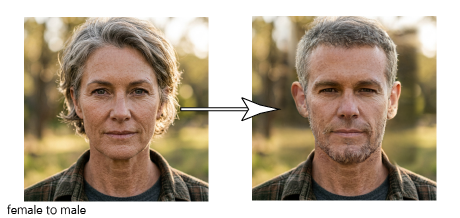
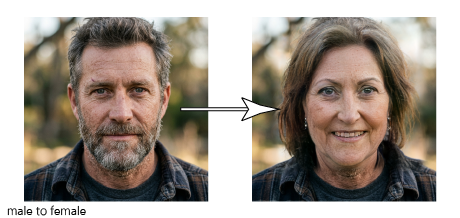

[](https://x.com/NorowaretaGemu)
[](https://opensource.org/licenses/MIT)

<div align="center">
  <a href="https://ko-fi.com/cursedentertainment">
    
  </a>
</div>

<br>


# Gender-Swap

#### Examples

<br>
<p align="center">
  
</p>
<br>
<p align="center">
  
</p>
<br>

FaceApp-style gender swap for photos. FaceApp's own model is proprietary, so this uses the
open-source approach that gives the same kind of result: a StyleGAN2 face generator edited in latent space.

1. **Detect & align** the face with OpenCV YuNet, cropping it the way FFHQ (StyleGAN2's training set) was cropped.
2. **Invert** the crop into StyleGAN2's W+ latent space with the [e4e](https://github.com/omertov/encoder4editing) encoder.
3. **Pivotal Tuning** ([PTI](https://github.com/danielroich/PTI)): briefly fine-tune the generator on your face so the result still looks like you (skipped in `fast` mode).
4. **Edit**: move the latent along a learned gender direction ([source](https://github.com/a312863063/generators-with-stylegan2)).
5. **Paste back** the swapped face into the original photo with a feathered blend.

## Setup

Requires Python 3.9 - 3.12; an NVIDIA GPU is strongly recommended (4 GB is enough).
Just run the launcher for your shell. On first run it creates the `psdenv` virtual environment,
installs `requirements.txt` (again whenever that file changes) and downloads any missing models
(about 1.3 GB, into `pretrained/`). Arguments are passed through to `main.py`.

```
run.bat                        # Windows (double-click or cmd)
.\run.ps1                     # PowerShell
./run.sh                       # Linux / macOS / Git Bash
run.bat photo.jpg --quality best
```

If PowerShell refuses to run scripts: `powershell -ExecutionPolicy Bypass -File run.ps1`.
To only fetch the models: `python main.py --download-models`.

## Usage

```
python main.py                                   # web UI
python main.py photo.jpg                         # writes photo_swapped.jpg
python main.py photo.jpg --to female --strength 1.3 --quality best -o out.png
```

| Option | Meaning |
| --- | --- |
| `--to auto\|female\|male` | Target gender. `auto` (the default) flips whatever is detected. |
| `--strength` | How far to push the edit (1.0 = full swap). |
| `--quality fast\|balanced\|best` | `fast` = encoder only (a few seconds); `balanced`/`best` fine-tune on your face for 100/250 steps (~1 / ~3 min on a GTX 1050 Ti). |
| `--save-crops` | Also save the aligned input, reconstruction and edit side by side. |

In the web UI you don't have to pick a direction: when you upload a photo, a gender classifier
(FairFace) checks the face and selects the opposite, e.g. "Detected **male** (99%), so **to female** is
selected". You can still change it to *To female*, *To male* or *Auto* before pressing Swap.

## Licenses

The code here is MIT-derived (e4e, rosinality/stylegan2-pytorch). The pretrained StyleGAN2 FFHQ
weights are under NVIDIA's non-commercial license, so this is for personal/research use.

---

<br>
<div align="center">
© Cursed Entertainment 2026
</div>
<br>
<div align="center">
<a href="https://cursed-entertainment.itch.io/" target="_blank">
    
</a>
</div>

